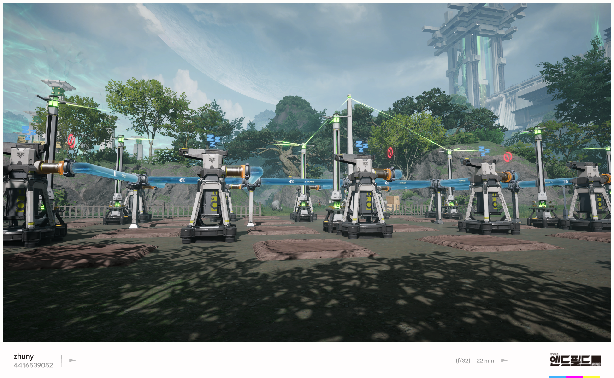
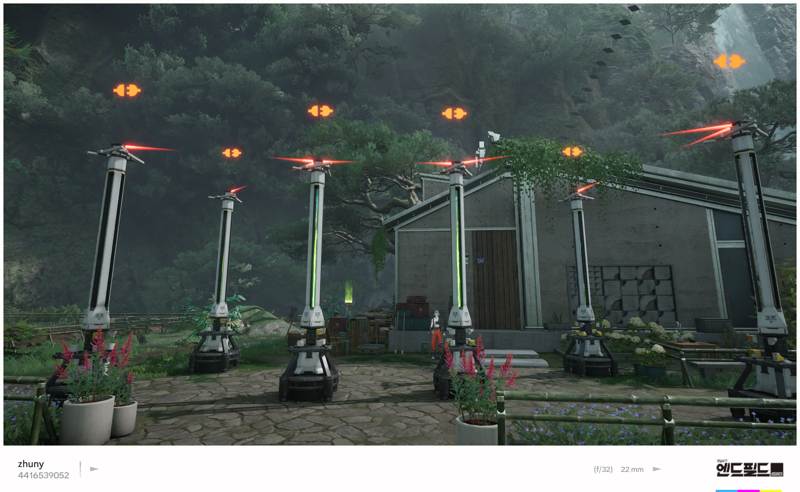
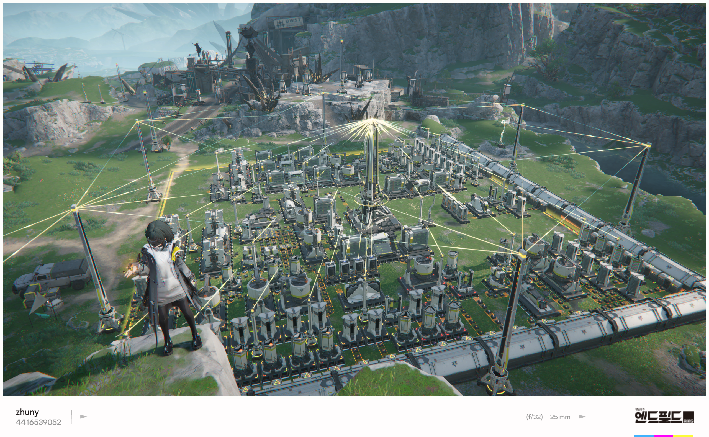

## 발단

평화롭게 엔드필드를 플레이하던 중, 어딘가 어색함을 느꼈다.
식양 전력 공급기(이하 전력 공급기)를 빽빽이 깔아 시설을 꾸미고 있는데, 화면에 그려지는 연결선만은 유난히 듬성듬성해 보였다.
전력 공급기는 30m 이내에 있으면 자동으로 전력이 이어지고, 연결된 공급기끼리는 꼭대기에서 선으로 이어진다.
그런데 실제로 보이는 선은 허전할 정도로 적었다. 30m 안에 여러 대를 깔아 두었을 텐데 말이다.

## 가설

연결 그래프(connected graph)가 주어졌을 때, 모든 정점(vertex)을 연결하면서도 사이클이 없는 부분 그래프를 spanning tree라고 한다.

전력 공급기를 정점에, 두 공급기가 30m 이내에 있을 때를 간선(edge)으로 두면 전력 그래프 G를 만들 수 있다.
G가 연결 그래프라고 가정하면, 게임이 공급기 사이에 실제로 그려 주는 선은 G의 spanning tree만으로도 충분하다.
모든 간선을 다 보여 줄 필요는 없기 때문이다.

## 실험

게임에서 더 중요한 것은 다른 정점 하나, 프로토콜 코어다. 전력을 공급하는 중앙 허브이며, 각 공급기가 여기까지 도달 가능한지가 핵심이다.
여기서 ‘연결’은 G 위에서 프로토콜 코어에서 해당 전력 공급기까지 경로(path)가 존재하는지의 여부다.

프로토콜 코어와 연결된 공급기만 spanning tree로 표현하려면, Dijkstra 알고리즘을 조금만 바꾸면 된다.
시작 정점(source)을 제외하고, 어떤 정점이 큐에 처음 들어올 때 그 직전 정점과 잇는 간선을 트리의 간선으로 두면 된다.

프로토콜 코어와 연결되지 않으면 어떻게 보이는지 궁금해 이것저것 더 깔아 보았다.
코어와 연결되지 않은 공급기끼리 선이 이어져도 초록색이 아니라 빨간색으로 표시된다.

이것저것 연결해 보니, 가끔 spanning tree처럼 보이지 않는 배치도 있었다. 다만 실플레이에서는 크게 신경 쓸 일은 아닌 것 같다.
어차피 프로토콜 코어에 닿지 않은 시설은 우선순위가 낮으니까.

## 해결

엔드필드가 실제로 어떻게 구현했는지보다, 내가 같은 상황이라면 어떻게 풀지를 생각해 보기로 했다.

앞에서는 연결 그래프를 가정했지만, 트리를 여러 개 묶은 forest로 일반화할 수 있다. 서로 다른 트리는 정점을 공유하지 않는다.

그러면 문제는 전력 공급기와 프로토콜 코어로 만들어진 그래프(연결되어 있을 필요는 없음)에서 minimum spanning forest를 구하는 일로 귀결된다.
알고리즘 자체는 minimum spanning tree와 같고, 그래프가 끊어져 있을 뿐이다.

간선의 가중치는 (1) 프로토콜 코어를 포함하는지, (2) 정점 사이의 물리적 거리 순으로 두면 된다.
코어와 가장 가까운 간선부터 잇고, 공급기끼리는 30m에 가깝게 떨어진 배치를 나중에 연결하는 식이다.
간선이 초록색인지 빨간색인지는, 구현 과정에서 쓰는 disjoint set으로 프로토콜 코어와 같은 연결 성분에 속하는지 보면 된다.

## 마무리

개발자 입장에서, 게임 속에서 이런 생각거리를 우연히 만나면 기분이 좋다.
요즘 게임은 비주얼이 먼저 눈에 들어오기 쉬운데, 그 안에 이런 거리·연결 문제가 숨어 있다는 것도 재미다.

거점을 연성진처럼 꾸며 보았다
