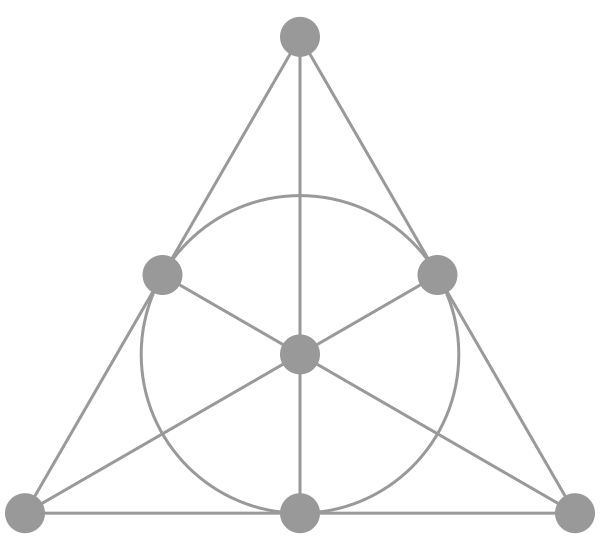

import PostNote from '../../../../components/PostNote.astro';

<PostNote thx="Kevin" thumbnail />

## 도블
도블은 카드로 하는 보드게임이다.
기본 규칙은 카드에 그림이 여러 개 그려져 있는데, 카드 두 장을 무작위로 뽑으면 그중 공통된 그림이 반드시 하나 있는 것을 찾아내는 것이 기본 규칙이다.
여기서는 이 규칙에 대해서 이야기 해 보려고 한다.

## 기하학
여기서 기하학의 특징 중 하나를 들 수 있다.
기하학의 기본 요소는 점과 선인데, 이 관계가 도블의 규칙과 비슷하다.

평행하지 않다면 두 직선은 유일한 하나의 점에서 만난다는 성질이 도블의 규칙과 닮아 있다.
실제로 카드를 선, 그림을 점으로 대응시키면 기하학과 닮아 있다.
서로 다른 두 점이 있으면 이 두 점을 잇는 유일한 직선이 있다는 성질도 있어서, 그림 두 개를 무작위로 고르면 (아마) 그 두 그림을 모두 포함한 카드 한 장이 나올 것이다.
간단한 예로, 썸네일에서 하나의 공통된 그림을 발견하는 것이 도블의 규칙이다.

다만 직선이 평행할 수 없다는 점에서 유클리드 기하학보다는 비유클리드 쪽이 떠올랐다.
그중 3차원 구면이 떠올랐다.
구면 위에서는 어떤 직선을 선택하더라도 평행한 직선이 없기 때문이었다.

그다음으로 해결해야 할 문제는 두 직선이 유일한 하나의 점에서 만나게 하는 것이었다.
3차원 구면에서 보면 두 직선이 만나는 점은 두 개인데, 항상 정반대 위치에 있다.
이를 해결하는 개념이 quotient다. 한 점과 그 반대편 점을 같은 것으로 취급하겠다는 뜻이다.

Quotient에 대해 부연하자면, 모듈러(mod)를 예로 들 수 있다.
mod n은 정수를 n으로 나누었을 때 나머지가 같은 수들을 같은 것으로 취급하겠다는 의미이다.
예를 들어 mod 3에서는 0, 3, 6, 9, ...를 모두 하나의 그룹으로 보고, 1, 4, 7, 10, ...도 또 하나의 그룹으로 본다.
즉, 개별 정수 대신 나머지가 같은 정수들의 집합을 하나의 대상으로 다루는 것이 Quotient의 한 예라고 볼 수 있다.

3차원 구면에서 한 점과 그 반대편 점을 같은 것으로 묶는 구조를 만들고 싶었다.
이때 서로 대응되는 두 점을 잇는 직선은 항상 원점을 지난다는 성질이 있다.
따라서 원점을 지나는 하나의 직선을 "점"으로 정의하면, 서로 반대편에 있는 두 점이 자연스럽게 하나의 "점"으로 합쳐진다.
같은 방식으로 원점을 지나는 평면을 "선"으로 정의하면, 우리가 원하는 구조를 얻을 수 있다.
평면과 구의 교차점이 만나는 형태가 구면 위의 직선과 같기 때문이다.

## 설계
원점을 지나는 무언가(직선이나 평면 등)는 선형대수에서는 n차원 vector space에서 subspace로 볼 수 있다.
여기서는 3차원 공간에서 1차원 subspace를 점, 2차원 subspace를 선으로 정의한 기하학으로 볼 수 있다.

3차원 공간을 표현하려면 field(체) 구조가 필요하다.
여기서는 실수보다 유한한 개수의 원소를 다뤄야 하므로, finite field를 기반으로 표현된다.

원소 수가 $n$인 finite field 위에서 3차원 vector space에서 1차원, 2차원 subspace의 수는 duality에 의해 같고, 그 수는 $n^2 + n + 1$이 된다.
$(a, b, c)$에서 $c$가 1인 경우 $n^2$가지, $b=1, c=0$인 경우 $n$가지, $a=1, b=0, c=0$인 경우 1가지
해서 총 $n^2 + n + 1$이다. 여기서 $n$은 field의 원소 수이므로, 어떤 소수 $p$와 자연수 $k$에 대해 $p^k$ 꼴을 한다.

$n=2$인 경우는 [Fano plane](https://en.wikipedia.org/wiki/Fano_plane)이라 불린다.
점 7개가 있으며, 선분 6개와 원 1개가 "선" 역할을 하고 있다.
어떤 점 두개를 골라도 이 두 점을 지나는 선이 유일하게 존재하며,
선 두개를 골라도 교차하는 점 하나가 유일하게 존재한다.

그래서 2 이상인 한 자릿수에서는 6을 제외하고 모두 가능한 형태가 된다.
6인 경우에는 여기서 언급한 방법으로는 설계할 수 없다. 다만 존재하지 않는지에 대한 논의는 별도의 이야기다.

도블의 경우 $n=7$이고, 이론상 카드는 $7^2 + 7 + 1 = 57$장이지만, 모종의 이유로 2장이 누락된 55장이다.

## 추가 자료
여기까지의 내용은 위키의 [Finite Projective Planes](https://en.wikipedia.org/wiki/Projective_plane#Finite_projective_planes)에 관한 내용이다.
더 깊이 알고 싶다면 링크를 따라가면 된다. 이에 따른 도블 카드 구현은 [해당 깃헙](https://github.com/zhuny/finite-projective-plane)에서 확인해 볼 수 있다.

## 저작권
* 해당 썸네일은 [엔드필드의 공식 위키](https://wiki.skport.com/endfield/catalog?mainTypeId=1&subTypeId=1&header=0)에서, 오퍼레이터 5명(관리자(여), 탕탕, 로시, 장방이, 미브)의 이미지를 기반으로 AI생성했다.
* Fano plane의 경우 위키피디아의 [Fano plane](https://en.wikipedia.org/wiki/Fano_plane)문서의 그림이다.
