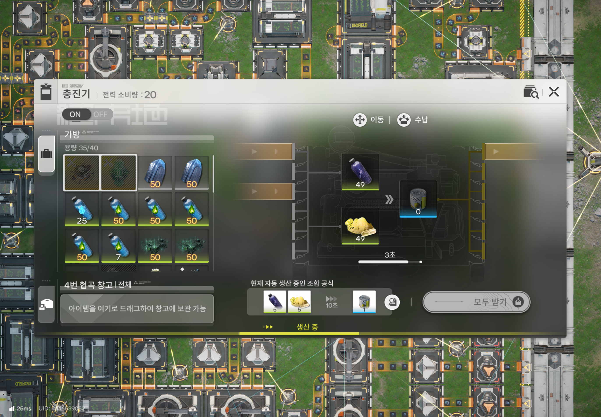
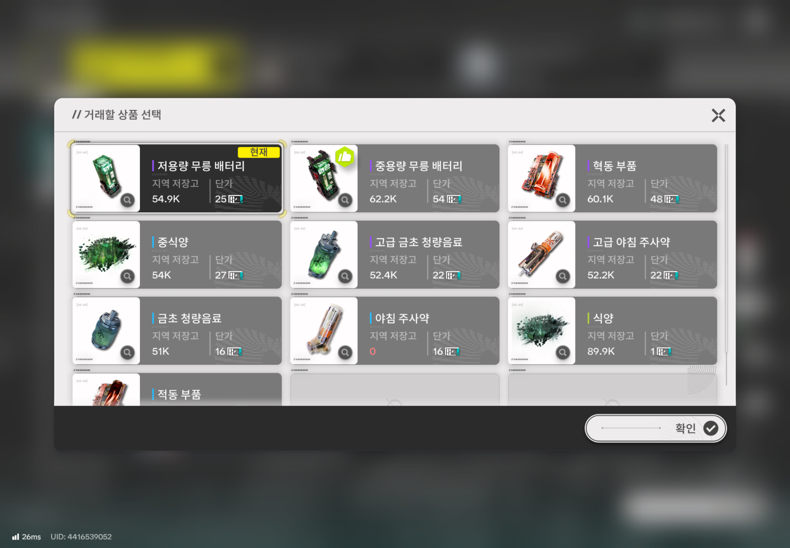

## Abstract
본문에서는 엔드필드 공장 시스템의 간략한 설명과
해당 시스템을 linear program으로 모델링하는 방법에 대해 설명한다.

## 엔드필드

엔드필드는 미소녀 공장 시뮬레이터로,
자원을 수집하고 공장을 통해 아이템을 생산한다.
일부 아이템은 거점 관리권이라는 인게임 재화와 교환할 수 있다.
목표는 최대한 인게임 재화를 얻을 수 있도록 하는 것이다.

### 공장 시스템

여기서 자원을 추출한다. 오리지늄 광물 등 여러 가지 자원을 추출할 수 있다.

이처럼 자원을 시설에 넣으면 시설은 자동으로 다른 아이템을 생산한다.

조합 공식의 난이도에 따라 다양한 수량의 거점 관리권으로 교환할 수 있다.

여기서는 공장 자체에 대한 청사진보다는 자원을 어떻게 분배해야 하는지에 대한 부분만 서술한다.

### Linear Programming
linear programming은 어떤 vector space $V = \mathbb{R}^n$에서
1. $0 \le x_i$이고
2. $Ax \lt b$를 만족하는 $0 \le x \in V$에 대해서
3. $c^T x$을 최대로 하는 $x$를 찾는 문제
이다.

여기서 $A$는 $m \times n$ 크기의 행렬이며, $b$는 $m$차원, $c$는 $n$차원 벡터가 된다.

### 모델링
엔드필드의 공장 시스템을 수식화 해보려고 한다.
게임으로부터 우리가 알 수 있는 상수값은 다음과 같다.
1. 기초 생산 자원량 ($f_n$) : 각 자원을 시간당 얼마나 채집 가능한지
2. 조합 공식 ($r_{mn}$) : 시간당 얼마의 자원을 소모하여 얼마의 다른 자원을 생산하는지
3. 거점 관리권 ($p_n$) : 자원 하나당 얼마의 거점 관리권으로 교환이 가능한지

그리고 우리가 최적화하기 위한 변수들은 다음과 같다.

1. 공장 시설 량 ($y_m$) : 각 조합 공식마다 어느 정도를 적용해야 하는가?
2. 최종 자원량 ($x_n$) : 각 자원이 최종적으로 얼마나 생성되는지
3. Objective function ($T$) : 거점 관리권을 얼마나 얻을 수 있는지

Index 표현은 $n$은 각 자원에 대한 index, $m$은 조합 공식의 index로 표현한다.

그려면, 각각의 요소에 대해서 살펴보도록 한다.

#### 기초 생산
만약 아무 공장도 없고 자원 채굴만 진행된 상태라면,
최종 자원량은 처음 채집한 기초 생산 자원량과 같다. 즉,

$$
\begin{aligned}
f_n &= x_n
\end{aligned}
$$

#### 공장 시설
만약 a라는 아이템 1개를 이용해서 b라는 아이템 1개를 만든다고 하는 조합 공식 1번이 있다고 하자.
그러면 a는 1개 소비되고, b는 1개 생산된다. 이를 각 최종 자원량에 반영하면 다음과 같다.

$$
\begin{aligned}
f_a &= x_a + r_{a1} y_1 \\
f_b &= x_b + r_{b1} y_1
\end{aligned}
$$

여기서 $r_{a1} = -1$, $r_{b1} = 1$이다. 기초 생산량에 조합 공식을 추가해 생기는 변화량을 반영했다.

이걸 모든 조합 공식에 적용하자면 다음과 같다.

$$
\begin{aligned}
f_n &= x_n + \sum_{m}r_{mn} y_m
\end{aligned}
$$

소비되는 경우에는 $r_{mn}$이 음수, 생산되는 경우 $r_{mn}$은 양수가 된다.

#### 거점 관리권
최종적으로 얻을 수 있는 거점 관리권은 다음과 같이 작성할 수 있다.

$$
\begin{aligned}
T &= \sum_{n}p_nx_n
\end{aligned}
$$

이 값($T$)을 최대화하는 것을 목표로 한다.

## 결론 및 한계
이것으로 간단하게 엔드필드의 공장 내용을 수식화하는 방법에 대해 논했다.
전력과 같이 여기에서는 언급하지 않았지만 LP에 도입해 볼 수 있는 요소도 있다.
그 외에 다양한 게임적 요소(거점 관리권 한계 및 추가 획득)들로 인해 이 모델링의 결과가 유의미하지 않을 수도 있다.
다만 이런 사고를 해 볼 수 있다는 것 자체가 유의미하기에 기록을 남겼다.

수학 혹은 전산학적으로 하나를 언급하고 마무리하려고 한다.

LP를 실수($\mathbb{R}$)위에서 푸는 것 자체는 Polynomial time algorithm이다.
반면, 실수가 아닌 정수($\mathbb{Z}$)위에서 푸는 것은 NP-Complete이다.
시설 수는 정수이기 때문에(LP 자체가 음이 아닌 값으로 제한하기에)
일반적으로 풀기 위해서는 NP 시간 복잡도를 가진다.
하지만, 엔드필드 자체가 각 조합 공식에 대한 계수가 모두 정수(최소한 유리수)이고,
실제 구하고자 하는 값을 실수라 가정하고 빠르게 계산해도 괜찮을 정도로 수치가 깔끔하게 떨어지게 설계되어 있다.
그래서 실수 위에서 풀어서 빠르게 계산해도 괜찮아 보인다.
