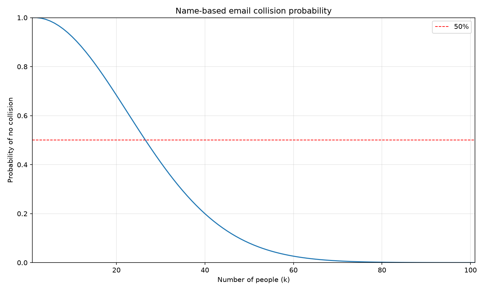

import PostNote from '../../../../components/PostNote.astro';

## 문제

이름을 영문으로 바꿔 이메일 로컬 파트(local part)를 만든다고 하자.
규칙 중 하나는 `{이름 이니셜}.{성}` 형태다.

```
yj.choi@zhuny.dev - 최유정
jh.yang@zhuny.dev - 본인
```

같은 규칙으로 주소를 배정할 때, **몇 명이 모이면 중복**이 생길까?
이 질문은 해시 충돌이나 UUID 중복을 생각할 때와 같은 유형이다.

## 생일 문제

비슷한 문제로 생일 문제가 있다. 23명이 모이면 생일이 겹칠 확률이 50% 이상이라는 것은 잘 알려져 있다.

$$
\begin{align}
\frac{{}_{365}P_{23}}{365^{23}} &\sim 49.27\%
\end{align}
$$

겹치지 않을 확률이 50% 미만으로 떨어지는 시점이 23명이다.

이 경우에는 생일이 균등하게(uniform) 분포한다는 가정 덕분에 계산이 단순했다.
분포가 uniform하지 않다면 이 값은 달라진다.

## 경우의 수

계산을 단순하게 하기 위해 성이 한 글자이고, 이름이 두 글자인 경우만 본다.

이름은 이론상 $26^2 = 676$가지이지만, 모든 조합이 흔하지는 않다.
성씨도 5천 개 이상이 있지만, 대부분은 1,000명 미만 규모다.

그래서 이름과 성 모두 상위 분포만 사용하기로 했다.
이름 이니셜은 GPT 추정상 상위 150개가 97.5%를 차지하므로, 상위 150개만 썼다.
성씨는 통계청이 개별 비율을 공개하지 않지만, 상위 50개의 누적 비율이 약 95%라고 한다.
상위 10·20·30·50개의 비율은 공개되어 있으므로, 이를 바탕으로 분포를 추정해 상위 50개만 사용했다.
정확한 분포를 알 수 없지만, 계산 자체가 충분히 의미 있다.

상위 $n$번째 이름·성의 확률을 각각 $l_n$, $f_n$이라 하자.
조합 경우의 수는 $50 \times 150 = 7500$이고, 각 조합의 확률은 $p_i = l_{n_i} f_{n_i}$다.

## 계산하기

각 확률 $p_i$가 주어졌을 때, $k$개를 독립적으로 뽑아 중복이 없을 확률은 다음과 같다.

$$
\begin{align}
P(p, k) &= k! \sum_{S_k} \prod_{i \in S_k} p_i
\end{align}
$$

여기서 $S_k$는 전체 집합에서 크기 $k$인 부분집합이다.
$k!$를 제외한 나머지 항은 다항식으로 한꺼번에 구할 수 있다.

다음 다항식을 보자.

$$
\begin{align}
\prod_{i \in S} (x + p_i) &= \sum_{k} a_k x^{N-k} \\
&= \sum_{k} \left( \sum_{S_k} \prod_{i \in S_k} p_i \right) x^{N-k}
\end{align}
$$

이 방식의 장점은 $k$에 대한 분포를 한 번에 얻을 수 있고, 필요한 차수까지만 계산해도 된다는 점이다.

생일 문제에서도 365개 중 23의 약 2배인 40명까지 분포를 보여주는 것이 의미 있다. 이는 $\sqrt{N}$의 배수 정도다.
마찬가지로 7500개 전부를 계산하지 않고, $\sqrt{7500} \approx 87$의 2배 정도인 180까지만 계산했다.
분포가 uniform하다면 103명에서 겹치지 않을 확률이 약 50%다.

$$
\begin{align}
\frac{{}_{7500}P_{103}}{7500^{103}} &\sim 49.48\%
\end{align}
$$

분포가 uniform하지 않으면 어떻게 될까?



답은 27명이다. 이때 겹치지 않을 확률은 48.79%였다. uniform하지 않은 분포가 결과에 상당한 영향을 준다.
해시 함수가 충돌을 줄이기 위해 결과를 최대한 uniform하게 만드는 이유도 이와 같다.
